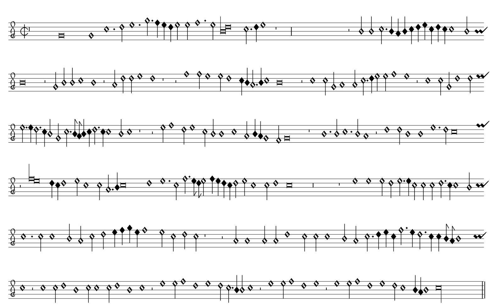

# mensural to mei
In recent years, numerous scores printed in white mensural notation have been scanned for digital archiving. These scanned documents are accessible through repositories such as the [**Bayrische Staatsbibliothek**](https://www.digitale-sammlungen.de/de/c/bb47abfa-9c8d-4cbe-8a62-4549e3194b74/about), [**Early Music Online**](https://www.royalholloway.ac.uk/research-and-teaching/departments-and-schools/music/research/research-projects-and-centres/early-music-online/) or over the [**Répertoire International des Sources Musicales (RISM)**](https://opac.rism.info/main-menu-/kachelmenu/about).  
The project presented here offers an automated method for converting these scanned originals into image-independent notation formats, such as the Music Encoding Initiative (MEI) or Humdrum, by utilizing computer vision-supported object recognition and classification techniques.

## Tables of Contents
- [mensural to mei](#mensural-to-mei)
  - [Tables of Contents](#tables-of-contents)
  - [Project Overview](#project-overview)
    - [Project information](#project-information)
    - [Training](#training)
    - [Pre-Pre-Processing of Source Images](#pre-pre-processing-of-source-images)
    - [Detection Process](#detection-process)
    - [Conversion Process](#conversion-process)
    - [Further steps](#further-steps)
  - [Installation](#installation)
    - [Configuration](#configuration)
  - [Usage](#usage)
  - [Citations](#citations)
    - [Score sources](#score-sources)
    - [Notation projects and tools](#notation-projects-and-tools)
    - [Object detection frameworks](#object-detection-frameworks)
  - [License](#license)
    - [Test Model](#test-model)
  - [Changelog](#changelog)
  - [Contribution](#contribution)

## Project Overview
Scanned documents serve to protect original materials from loss or damage, while enabling global access. However, further electronic processing, such as conversion to [**Music Encoding Initiative**](https://music-encoding.org) (MEI) or [**Humdrum**](https://www.humdrum.org/) formats, typically requires manual intervention, which is both labor-intensive and time-consuming. The present project addresses this issue by employing specially trained object recognition networks to identify the symbols of white mensural notation and convert them into MEI or Humdrum formats. Users can feed scanned documents in image or PDF format and receive the converted data as output.  (**Restriction**: Currently, only the most common and important symbols are recognised and transferred.; text transfer is part of the further development of the project. Some symbols of the white mensural notation are not yet implemented in the MEI-format.) 

The following image shows the original file: Taken from Giovanni M. Rosso, MOTTETI DI GIO: MARIA ROSSO MAESTRO DI CAPELLA DEL DVOMO DI MANTOVA, Venetia 1567, *Bayrische Staatsbibliothek 4 Mus. pr. 200#Beibd.7*


Here is the converted MEI file: processed with [**Verovio Editor**](https://editor.verovio.org/)



### Project information

This project is part of a larger initiative aimed at translating printed white mensural notation from the turn of the 16th and 17th centuries directly into modern notation. Detailed information can be found in the following publication:

O. Nowitzki et al, Optical Music Recognition of Printed White Mensural Notation: Conversation to Modern Notation using Object Detection Mechanisms, IJHAC 2022, 33-49, DOI: 10.3366/ijhac.2022.0275

### Training

To train the object recognition and classification model for pitch detection, several compositions by different composers were downloaded from the aforementioned sources. Selected pages were extracted as high-resolution image files, and over 400,000 symbols were annotated and classified on these pages.

This data was used to train a YOLOv8 model (Further information on YOLOv8 can be found on the [**YOLOv8 website**](https://github.com/ultralytics/ultralytics)), which was subsequently exported as an ONNX model ([**Open Neural Network Exchange**](https://onnx.ai)) for compatibility with various computer architectures.

(**Note**: By default, only a simpler model can be downloaded to test the functionality of the programme)

### Pre-Pre-Processing of Source Images

The model is designed to recognize the type and pitch of notes or notation symbols on a sheet of music. The source images must meet the following requirements:

- printed sheets with scores of white mensural notation from the turn of the 16th and 17th centuries
- one-sided images (either left or right page of the music book)
- Resolution of at least 150 dpi
- staves as horizontal as possible from left to right (falling or rising staves are possible to a small extent, simply test)
- Sequence of the staves from top to bottom
- Sufficient margins

Most scans from the **Bayerische Staatsbibliothek** meet these criteria and can be used directly as sources. The program converts these PDF files into a sequence of high-resolution images, which are then processed sequentially. If the source images do not meet these specifications, they must be processed accordingly to ensure successful recognition.

### Detection Process

The pipeline includes the following steps:
1. Pre-processing of the source image: conversion to greyscale, normalisation, denoising, rescaling.
2. Object recognition to identify the staves on the page.
3. Cropping the staves from the pre-processed image and performing symbol recognition.
4. Isolating symbols for classification (notes for pitch, clefs, and mensural symbols) and performing classification.
5. Transferring the symbol list into MEI format and optionally into Humdrum format.
6. Saving the output files.

### Conversion Process

Recognized symbols and notes are analyzed and converted into MEI format (Humdrum optional). The converted files are saved in the output folders.

The program attempts to recognize multiple pieces of music on one sheet and saves each piece in a separate MEI file. For multi-page compositions, the program combines the pages into a single file.

These processes may require manual reworking for accuracy.

### Further steps

The files can then be further processed using, for example, the following tools:

- for the mei-format:
  - [**Verovio Editor**](https://editor.verovio.org/)
  - [**mei-friend**](https://mei-friend.mdw.ac.at/)
- for the humdrum-format:
  - [**VerovioHumdrumViewer VHV**](http://verovio.humdrum.org/)


## Installation

**The project operates optimally in an Ubuntu environment, both in WSL2 and natively.** Clone the repository and ensure the following requirements are met:

- Python 3.11 (other versions not tested)
- poppler-framework for PDF2image library (for detailed information refer to [PDF2image documentation](https://pypi.org/project/PDF2image/))
- requirements comming with the project
- Installation of the required modules for the libraries to be installed (e.g. ffmpeg, libsm6, libxext6 for opencv-python on a Linux server)

Download the models, and unzip them into the root project folder. This will create a *models*-folder and all sub-directories:

[mensural_to_mei test model](https://drive.google.com/uc?export=download&id=1Qw-XAVJv5GrC_AtZ1z0DqwN5MXJYD1Qa) (7zip format, 558 MB)

Example to download the test model in linux terminal or server:
```
pip install gdown
gdown https://drive.google.com/uc?export=download&id=1Qw-XAVJv5GrC_AtZ1z0DqwN5MXJYD1Qa
```

### Configuration

The pathes to the models can be configured here: `mensural_to_mei/configs/config.py`

Please leave the image sizes unchanged otherwise mentioned. The models are trained according to these sizes.

## Usage

Possible Parameters:

| Parameter      | Description                                                                                       |
|----------------|---------------------------------------------------------------------------------------------------|
| --sources, -s  | (mandatory) path to source image, PDF file or a csv file containing paths to source images        |
| --pages, -p    | (mandatory for PDF-files) pages to convert in PDF-file (e.g. '1-3,5')                             |
| --humdrum, -hm | (optional) create humdrum output file                                                             |
| --debug, -d    | (optional) debug mode - saves the detection results in a pickle file to speed-up conversion tests |
| --help, -h     | help                                                                                              |

**Example:**

To generate the image shown from the PDF file supplied, the following command line must be entered in the project directory:

`python mensural_to_mei.py --source './Rosso - Motteti di gio.PDF' --pages 9`

**Note**: Only a smaller model for object recognition and pitch classification is provided for testing. The conversion result may differ from the example shown.

It is of course possible to translate a large number of pages directly. However, it is advisable to only transfer a reasonable number at once, as the time required for the transfer depends heavily on the hardware used.

## Citations

### Score sources

- [**Bayrische Staatsbibliothek**](https://www.digitale-sammlungen.de/de/c/bb47abfa-9c8d-4cbe-8a62-4549e3194b74/about)
- [**Early Music Online**](https://www.royalholloway.ac.uk/research-and-teaching/departments-and-schools/music/research/research-projects-and-centres/early-music-online/)
- [**Répertoire International des Sources Musicales (RISM)**](https://opac.rism.info/main-menu-/kachelmenu/about)

Sheet music book included in the project (not changed in any way):

Giovanni M. Rosso, MOTTETI DI GIO: MARIA ROSSO MAESTRO DI CAPELLA DEL DVOMO DI MANTOVA, Venetia 1567, *Bayrische Staatsbibliothek 4 Mus. pr. 200#Beibd.7* [Link](https://mdz-nbn-resolving.de/details:bsb00094117)

### Notation projects and tools

[**Music Encoding Initiative**](https://music-encoding.org/) for the MEI-format

- [**Verovio Editor**](https://editor.verovio.org/)
- [**mei-friend**](https://mei-friend.mdw.ac.at/)

[**Humdrum Toolkit**](https://www.humdrum.org/) for the Humdrum-format

- [**VerovioHumdrumViewer VHV**](http://verovio.humdrum.org/)

### Object detection frameworks

[**YOLOv8 by ultralytics**](https://github.com/ultralytics/ultralytics)  
[**YOLOv8 Documentation**](https://docs.ultralytics.com/)

[**Open Neural Network Exchange**](https://onnx.ai)

## License

This project is licensed under the terms of the MIT License. You are free to use, modify, and distribute the source code. The license file can be found in LICENSE.md.

### Test Model

Within this repository, you'll also find a test model. You can download it using the following link: [Download Test Model](https://drive.google.com/uc?export=download&id=1Qw-XAVJv5GrC_AtZ1z0DqwN5MXJYD1Qa). Please note that this test model is also subject to the MIT License.

Other models not provided via this link are excluded from the MIT License.

## Changelog

Changes to the project are documented in the following file: [CHANGELOG](docs/CHANGELOG.md)

## Contribution

We're always looking for ways to improve, so please report any problems or requests in the appropriate sections of this repository.